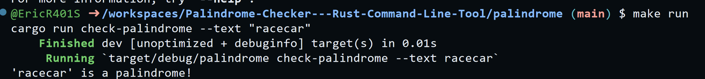
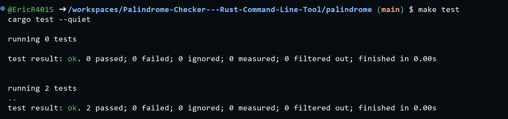

# Palindrome Checker - Rust Command Line Tool

## Description
In this project, we build a rust command line tool to reverse a string and check if it is a palindrome, a word whose reverse form is identical to the original. I also add a unit test to check if the function is performing as expected.

[Click Here for this Project's Overview Demo Video!!!]()

## Why opt for a palindrome checker?

The objective of this 8th mini project for the cloud computing class is to build a simple and small tool. Plus, palindromes are fun. Did you notice that a palindrome is not a palindrome? 

## Usage

Use it to reverse any string. If using longer strings, make sure to encase all of it in double quotes.

## Quick Usage

To demo run the code quickly and directly, run the following

```
$ cd palindrome && make all

# This command contains the following:
format:
	cargo fmt --quiet

lint:
	cargo clippy --quiet

test:
	cargo test --quiet

run:
	cargo run check-palindrome --text "racecar"
```

## Setup Instructions

1. Use the CLAP framework to write out the parsing logic.
```
// A command-line palindrome checker
use clap::Parser;

#[derive(Parser)]
#[clap(
    version = "1.0",
    author = "Eric Rios",
    about = "A simple palindrome checker"
)]
struct Cli {
    #[clap(subcommand)]
    command: Option<Commands>,
}

#[derive(Parser)]
enum Commands {
    #[clap(version = "1.0", author = "Eric Rios")]
    CheckPalindrome {
        #[clap(short, long)]
        text: String,
    },
}
```

2. Write supporting logic for the actual tool.
```
fn is_palindrome(s: &str) -> bool {
    let normalized = s
        .to_lowercase()
        .chars()
        .filter(|c| c.is_alphanumeric())
        .collect::<String>();
    normalized == normalized.chars().rev().collect::<String>()
}
```

3. Run the tool with both the binary and cargo run directly.
```
$ ./target/debug/palindrome check-palindrome --text "racecar" 
$ cargo run check-palindrome --text "racecar" 
```


4. Add the unit test with the assert statements.
```
use assert_cmd::Command;

#[test]
fn test_palindrome_positive() {
    let mut cmd = Command::cargo_bin("palindromemp8").unwrap();
    cmd.arg("check-palindrome").arg("--text").arg("level");
    cmd.assert().success().stdout("'level' is a palindrome!\n");
}

#[test]
fn test_palindrome_negative() {
    let mut cmd = Command::cargo_bin("palindromemp8").unwrap();
    cmd.arg("check-palindrome").arg("--text").arg("hello");
    cmd.assert()
        .success()
        .stdout("'hello' is not a palindrome.\n");
}
```

5. Run the unit test. Inspect the output of the unit test to verify success or failure.
```
# command to run tests
$ cargo test --quiet
```


## Result

Here I share the results for both the tool and the unit test.

Command Line Tool:


Unit Test:


## Licenses
Creative Commons.

## Status
This project is complete as of April 2024.